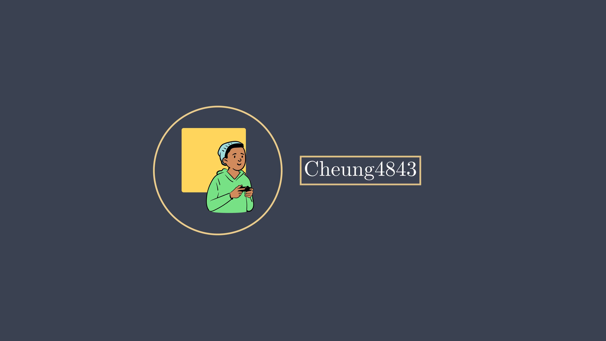
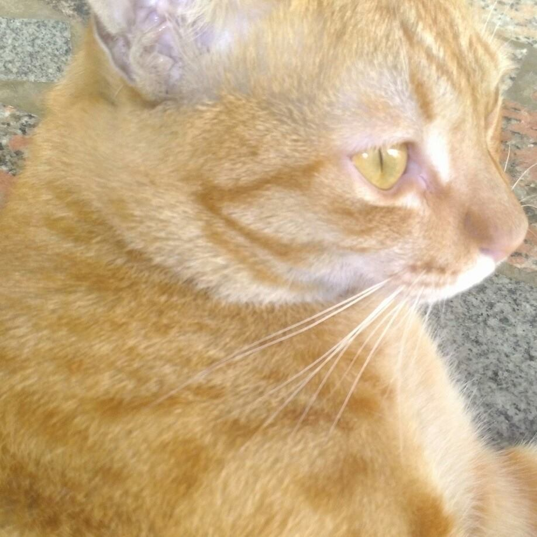

<div align="center">
<h1 align="center">Cheung4843's home🤔</h1>

```
Shoot for the moon. Even if you miss, you'll land among the stars.
```



</div>

# **Short intro**
<table style="border:none">
<tr>
  <td style="vertical-align: top">
    
  </td>
  <td>
  </td>
  <td>

  [](https://git.io/streak-stats)

  
  
  </td>
</tr>
</table>

# **About me**
- Hi, I'm Cheung4843, a pythonista. I love solving algorithm problems and creating visualizations. 

- In my free time, I love learning new things, watching movies, and playing video games.

- Well, I don't konw what to say, but I'm a good listener. If you have any questions, feel free to ask me.

# Display
https://github.com/cheung4843/cheung4843/assets/46809977/5cd8d7a8-3704-4c93-b5c3-97be484f2918

https://github.com/cheung4843/cheung4843/assets/46809977/80a3dc7d-5171-4469-bf03-025617c8e86f

https://github.com/cheung4843/cheung4843/assets/46809977/9d89f821-4ac3-43bc-bf06-f517e4dc67a0