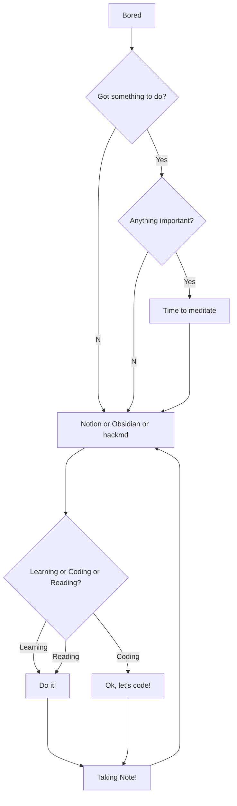

<div align="center">
<h1 align="center">Cheung4843's home🤔</h1>

```
Shoot for the moon. Even if you miss, you'll land among the stars.
```
</div>

## Strange Functons
Assume my growth function $f(n)=3n+2$, than:

$$
\underbrace{1 \lt logn \lt \sqrt{n} \lt n^{\frac{2}{3}}}_\text{lower bound, including Ω(n)} \lt \overbrace{n}^\text{Average bound, Θ(n)} \lt  \underbrace{nlogn \lt n^2 \lt n^3 \lt \cdots \lt 2^n \lt 3^n \lt 4^n \lt \cdots \lt n^n}_\text{upper bound, including O(n)}
$$

## Strange FlowChart



